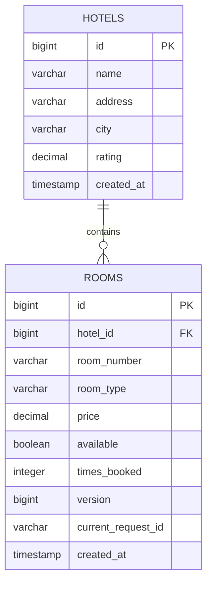
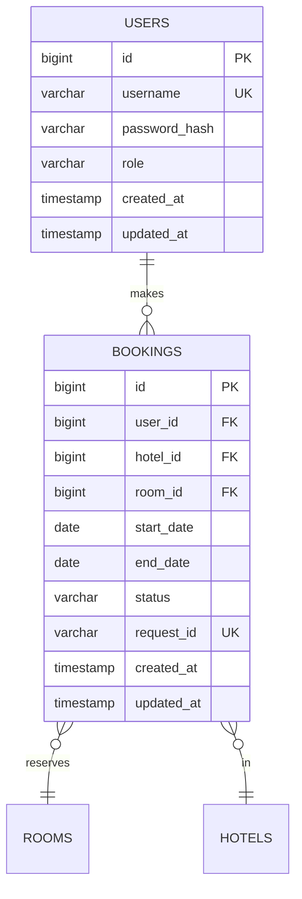

# 🏨 Spring Hotel Management System (HMS)

[](https://openjdk.org/projects/jdk/21/)
[](https://spring.io/projects/spring-boot)
[](https://spring.io/projects/spring-cloud)
[](LICENSE)

Микросервисная система управления бронированием отелей на базе Spring Boot, реализующая современные паттерны распределенных систем: SAGA, Circuit Breaker, Service Discovery, JWT Security.

## 📋 Содержание

- [Архитектура](#-архитектура)
- [Технологический стек](#-технологический-стек)
- [Ключевые возможности](#-ключевые-возможности)
- [Быстрый старт](#-быстрый-старт)
- [Структура проекта](#-структура-проекта)
- [Модель данных (ER-диаграмма)](#-модель-данных-er-диаграмма)
- [API Документация](#-api-документация)
- [SAGA Pattern](#-saga-pattern)
- [Механизмы согласованности данных](#-механизмы-согласованности-данных)
- [Безопасность](#-безопасность)
- [Тестирование](#-тестирование)
- [Архитектурные решения (ADR)](#-архитектурные-решения-adr)

## 🏗️ Архитектура

### Микросервисная архитектура

```
┌─────────────────────────────────────────────────────────────────┐
│                         Client (Browser/Postman)                 │
└───────────────────────────────┬─────────────────────────────────┘
                                │
                                ▼
                    ┌───────────────────────┐
                    │   API Gateway :8080   │
                    │  - JWT Validation     │
                    │  - Load Balancing     │
                    │  - Circuit Breaker    │
                    └───────────┬───────────┘
                                │
                    ┌───────────┴───────────┐
                    │                       │
                    ▼                       ▼
        ┌─────────────────────┐ ┌─────────────────────┐
        │ Booking Service     │ │ Hotel Service       │
        │     :8082           │ │     :8081           │
        │                     │ │                     │
        │ - SAGA Orchestrator │ │ - Room Management   │
        │ - Compensation      │ │ - Statistics        │
        │ - Retry Logic       │ │ - Availability      │
        │                     │ │                     │
        │ ┌─────────────────┐ │ │ ┌─────────────────┐ │
        │ │  H2 Database    │ │ │ │  H2 Database    │ │
        │ │  (bookings)     │ │ │ │  (hotels/rooms) │ │
        │ └─────────────────┘ │ │ └─────────────────┘ │
        └──────────┬──────────┘ └──────────┬──────────┘
                   │                       │
                   └───────────┬───────────┘
                               │
                               ▼
                    ┌──────────────────────┐
                    │  Eureka Server :8761 │
                    │  Service Discovery   │
                    └──────────────────────┘
```

### SAGA Pattern Flow

```
┌──────────────┐     ┌─────────────┐     ┌──────────────┐
│   Client     │────▶│  Booking    │────▶│    Hotel     │
│              │     │  Service    │     │   Service    │
└──────────────┘     └─────────────┘     └──────────────┘
                            │                    │
                     1. Create PENDING           │
                            │                    │
                            ├──────────────────▶ │
                            │  Confirm Availability
                            │                    │
                            │ ◀──────────────────┤
                            │    Success/Fail    │
                     2. Update Status            │
                        (CONFIRMED/CANCELLED)    │
                            │                    │
                     3. Compensation (if needed) │
                            ├──────────────────▶ │
                            │   Release Room     │
                            │                    │
```

## 🛠️ Технологический стек

### Backend Framework
- **Java 21** - Long-Term Support версия
- **Spring Boot 3.5.9** - основной фреймворк
- **Spring Cloud 2025.0.1** - микросервисная инфраструктура
  - Spring Cloud Netflix Eureka - Service Discovery
  - Spring Cloud Gateway - API Gateway
  - Spring Cloud OpenFeign - HTTP клиент
  - Spring Cloud LoadBalancer - балансировка нагрузки

### Resilience & Reliability
- **Resilience4j 2.3.0**
  - Circuit Breaker - защита от каскадных сбоев
  - Retry - автоматические повторы
  - Timeout - контроль времени выполнения

### Security
- **Spring Security 6.x** - фреймворк безопасности
- **JWT (jjwt 0.13.0)** - аутентификация и авторизация
- **BCrypt** - хеширование паролей

### Data & Persistence
- **Spring Data JPA** - ORM слой
- **H2 Database** - in-memory база данных
- **Hibernate** - JPA провайдер

### Development Tools
- **Lombok 1.18.42** - уменьшение boilerplate кода
- **MapStruct 1.6.3** - маппинг DTO ↔ Entity
- **Validation API** - валидация данных
- **SpringDoc OpenAPI 2.8.15** - документация API

### Testing
- **JUnit 5** - тестовый фреймворк
- **Mockito 5.21.0** - моки и стабы
- **MockMvc** - тестирование REST контроллеров
- **Spring Boot Test** - интеграционное тестирование

## ✨ Ключевые возможности

### 1. Распределенные транзакции (SAGA Pattern)
- ✅ Choreography-based SAGA
- ✅ Автоматическая компенсация при сбоях
- ✅ Идемпотентность через `requestId`
- ✅ Correlation tracking для трассировки

### 2. Устойчивость к сбоям (Resilience)
- ✅ Circuit Breaker (50% failures → OPEN)
- ✅ Retry с exponential backoff (1s, 2s, 4s)
- ✅ Timeout (5 секунд)
- ✅ Fallback методы

### 3. Безопасность
- ✅ JWT токены с ролями (USER/ADMIN)
- ✅ Resource Server на каждом микросервисе
- ✅ Method-level security (@PreAuthorize)
- ✅ Корректные HTTP статусы (401/403)

### 4. Service Discovery
- ✅ Eureka Server для регистрации сервисов
- ✅ Client-side load balancing
- ✅ Health checks
- ✅ Динамическое обнаружение

### 5. Алгоритм распределения номеров
- ✅ Сортировка по `timesBooked ASC, id ASC`
- ✅ Равномерное распределение нагрузки
- ✅ Pessimistic + Optimistic locking для защиты критичных операций

## 🚀 Быстрый старт

### Предварительные требования

```bash
# Проверка версии Java
java -version  # Должна быть 21+

# Проверка Maven
mvn -version   # Должна быть 3.8+
```

### Установка и запуск

#### 1. Клонирование репозитория

```bash
git clone https://github.com/vanhellthing93/sf.mephi.spring-hms.git
cd sf.mephi.spring-hms
```

#### 2. Сборка проекта

```bash
mvn clean install
```

#### 3. Запуск микросервисов (последовательность важна!)

**Шаг 1: Eureka Server**
```bash
cd eureka-server
mvn spring-boot:run
```
Проверка: http://localhost:8761

**Шаг 2: API Gateway**
```bash
cd api-gateway
mvn spring-boot:run
```
Порт: 8080

**Шаг 3: Hotel Service**
```bash
cd hotel-service
mvn spring-boot:run
```
Порт: 8081

**Шаг 4: Booking Service**
```bash
cd booking-service
mvn spring-boot:run
```
Порт: 8082

### Проверка работоспособности

```bash
# Проверка Eureka Dashboard
curl http://localhost:8761

# Проверка Health endpoints
curl http://localhost:8080/actuator/health
curl http://localhost:8081/actuator/health
curl http://localhost:8082/actuator/health
```

## 📁 Структура проекта

```
sf.mephi.spring-hms/
│
├── eureka-server/              # Service Discovery
│   ├── src/main/java/
│   │   └── sf/mephi/eureka/
│   │       └── EurekaServerApplication.java
│   └── src/main/resources/
│       └── application.yml
│
├── api-gateway/                # API Gateway
│   ├── src/main/java/
│   │   └── sf/mephi/gateway/
│   │       ├── ApiGatewayApplication.java
│   │       ├── config/
│   │       │   ├── GatewayConfig.java
│   │       │   └── SecurityConfig.java
│   │       └── filter/
│   │           └── JwtAuthenticationFilter.java
│   └── src/main/resources/
│       └── application.yml
│
├── hotel-service/              # Hotel & Room Management
│   ├── src/main/java/
│   │   └── sf/mephi/hotel/
│   │       ├── HotelServiceApplication.java
│   │       ├── controller/
│   │       │   ├── HotelController.java
│   │       │   └── RoomController.java
│   │       ├── service/
│   │       │   ├── HotelService.java
│   │       │   └── RoomService.java
│   │       ├── repository/
│   │       │   ├── HotelRepository.java
│   │       │   └── RoomRepository.java
│   │       ├── entity/
│   │       │   ├── Hotel.java
│   │       │   └── Room.java
│   │       └── dto/
│   └── src/main/resources/
│       ├── application.yml
│       └── data.sql
│
├── booking-service/            # Booking & SAGA Orchestrator
│   ├── src/main/java/
│   │   └── sf/mephi/booking/
│   │       ├── BookingServiceApplication.java
│   │       ├── controller/
│   │       │   ├── BookingController.java
│   │       │   └── AuthController.java
│   │       ├── service/
│   │       │   ├── BookingService.java
│   │       │   └── UserService.java
│   │       ├── client/
│   │       │   └── HotelServiceClient.java
│   │       ├── entity/
│   │       │   ├── Booking.java
│   │       │   └── User.java
│   │       └── config/
│   │           ├── SecurityConfig.java
│   │           └── ResilienceConfig.java
│   └── src/main/resources/
│       ├── application.yml
│       └── data.sql
│
└── common-lib/                 # Shared utilities
    ├── src/main/java/
    │   └── sf/mephi/common/
    │       ├── dto/
    │       │   ├── ErrorDTO.java
    │       │   └── PageDTO.java
    │       ├── exception/
    │       │   ├── BaseException.java
    │       │   ├── NotFoundException.java
    │       │   └── ValidationException.java
    │       ├── security/
    │       │   ├── JwtUtil.java
    │       │   └── SecurityConstants.java
    │       └── util/
    │           └── CorrelationIdUtil.java
    └── pom.xml
```

## 🗄️ Модель данных (ER-диаграмма)

Проект использует **микросервисную архитектуру с разделением баз данных** (Database per Service):
- **Hotel Service** - управление отелями и номерами
- **Booking Service** - управление пользователями и бронированиями

### Hotel Service Database


### Booking Service Database


### Ключевые поля для механизмов согласованности

| Таблица  | Поле               | Назначение                                                           |
| -------- | ------------------ | -------------------------------------------------------------------- |
| ROOMS    | version            | Optimistic Locking - автоматический инкремент при UPDATE             |
| ROOMS    | times_booked       | Load Balancing - счётчик бронирований для равномерного распределения |
| ROOMS    | current_request_id | Tracking - последний запрос, изменивший номер                        |
| BOOKINGS | request_id         | Idempotency - уникальный UUID для предотвращения дублирования        |
| BOOKINGS | status             | SAGA State - состояние транзакции (PENDING, CONFIRMED, CANCELLED)    |

### Связи между микросервисами
┌─────────────────────────────────────────────────────────┐
│           Booking Service Database                      │
│                                                         │
│  USERS ──┬──> BOOKINGS                                 │
│          │         │                                    │
│          │         ├─── hotel_id (External Reference)  │──┐
│          │         └─── room_id  (External Reference)  │──┼─┐
│          │                                              │  │ │
└──────────┼──────────────────────────────────────────────┘  │ │
│                                                 │ │
│    Cross-Service Communication via Feign       │ │
│                                                 │ │
┌──────────┼─────────────────────────────────────────────────┼─┼──┐
│          │         Hotel Service Database               │ │ │
│          │                                              │ │ │
│          └────> HOTELS ◄──────────────────────────────────┘ │
│                    │                                        │
│                    └──> ROOMS ◄────────────────────────────┘
│                                                             │
└─────────────────────────────────────────────────────────────┘

Примечание: hotel_id и room_id в таблице BOOKINGS являются логическими ссылками, а не внешними ключами на уровне БД, так как сервисы имеют отдельные базы данных.

📖 Полная ER-диаграмма: docs/ER-DIAGRAM.md

## 📚 API Документация

### Базовые URL

- **API Gateway**: `http://localhost:8080`
- **Booking Service**: `http://localhost:8082` (через Gateway: `/api/v1/bookings`)
- **Hotel Service**: `http://localhost:8081` (через Gateway: `/api/v1/hotels`)
- **Eureka Dashboard**: `http://localhost:8761`

### Аутентификация

#### 1. Регистрация пользователя

```bash
POST http://localhost:8080/api/v1/auth/register
Content-Type: application/json

{
  "username": "john.doe",
  "password": "password123",
  "role": "USER"
}
```

**Ответ:**
```json
{
  "id": 1,
  "username": "john.doe",
  "role": "USER",
  "createdAt": "2026-01-13T20:00:00"
}
```

#### 2. Вход (получение JWT токена)

```bash
POST http://localhost:8080/api/v1/auth/login
Content-Type: application/json

{
  "username": "john.doe",
  "password": "password123"
}
```

**Ответ:**
```json
{
  "token": "eyJhbGciOiJIUzI1NiIsInR5cCI6IkpXVCJ9...",
  "type": "Bearer",
  "expiresIn": 3600,
  "username": "john.doe",
  "role": "USER"
}
```

### Hotel Service API

#### 3. Получить список отелей

```bash
GET http://localhost:8080/api/v1/hotels?page=0&size=10
Authorization: Bearer <JWT_TOKEN>
```

**Ответ:**
```json
{
  "content": [
    {
      "id": 1,
      "name": "Grand Hotel",
      "address": "123 Main St, Moscow",
      "city": "Moscow",
      "rating": 4.5,
      "totalRooms": 50
    }
  ],
  "page": 0,
  "size": 10,
  "totalElements": 1,
  "totalPages": 1
}
```

#### 4. Получить рекомендованные номера (равномерное распределение)

```bash
GET http://localhost:8080/api/v1/rooms/recommend?hotelId=1
Authorization: Bearer <JWT_TOKEN>
```

**Ответ:**
```json
[
  {
    "id": 1,
    "hotelId": 1,
    "roomNumber": "101",
    "roomType": "STANDARD",
    "price": 5000.00,
    "available": true,
    "timesBooked": 3
  },
  {
    "id": 2,
    "hotelId": 1,
    "roomNumber": "102",
    "roomType": "DELUXE",
    "price": 8000.00,
    "available": true,
    "timesBooked": 3
  }
]
```

#### 5. Создать отель (ADMIN)

```bash
POST http://localhost:8080/api/v1/hotels
Authorization: Bearer <ADMIN_JWT_TOKEN>
Content-Type: application/json

{
  "name": "Luxury Hotel",
  "address": "456 Park Ave, Moscow",
  "city": "Moscow",
  "rating": 5.0
}
```

### Booking Service API

#### 6. Создать бронирование (запуск SAGA)

```bash
POST http://localhost:8080/api/v1/bookings
Authorization: Bearer <JWT_TOKEN>
Content-Type: application/json
Idempotency-Key: 550e8400-e29b-41d4-a716-446655440000

{
  "roomId": 1,
  "startDate": "2026-03-01",
  "endDate": "2026-03-05",
  "autoSelect": false
}
```

**Ответ (успех):**
```json
{
  "id": 10,
  "userId": 1,
  "roomId": 1,
  "hotelId": 1,
  "startDate": "2026-03-01",
  "endDate": "2026-03-05",
  "status": "CONFIRMED",
  "requestId": "550e8400-e29b-41d4-a716-446655440000",
  "createdAt": "2026-01-13T20:30:00"
}
```

**Логи SAGA (успешный сценарий):**
```
INFO  [correlationId=abc-123] Starting SAGA: Create booking for user john.doe
INFO  [correlationId=abc-123] SAGA Step 1: Booking created in PENDING status, id=10
INFO  [correlationId=abc-123] SAGA Step 2: Confirming availability with Hotel Service
INFO  [correlationId=abc-123] SAGA Step 3: Room availability confirmed, roomId=1
INFO  [correlationId=abc-123] SAGA Completed: Booking confirmed, id=10, status=CONFIRMED
```

**Ответ (сбой + компенсация):**
```json
{
  "id": 11,
  "userId": 1,
  "roomId": 1,
  "status": "CANCELLED",
  "requestId": "660e8400-e29b-41d4-a716-446655440001",
  "createdAt": "2026-01-13T20:35:00"
}
```

**Логи SAGA (сбой + компенсация):**
```
INFO  [correlationId=xyz-789] Starting SAGA: Create booking for user john.doe
INFO  [correlationId=xyz-789] SAGA Step 1: Booking created in PENDING status, id=11
ERROR [correlationId=xyz-789] SAGA Failed: Room unavailable
INFO  [correlationId=xyz-789] SAGA Compensation: Releasing room slot
INFO  [correlationId=xyz-789] Compensating booking - attempt 1/3 for roomId=1
INFO  [correlationId=xyz-789] Compensation successful: Slot released
INFO  [correlationId=xyz-789] SAGA Rollback: Booking cancelled, id=11, status=CANCELLED
```

#### 7. Получить мои бронирования

```bash
GET http://localhost:8080/api/v1/bookings?page=0&size=10&sort=createdAt,desc
Authorization: Bearer <JWT_TOKEN>
```

**Ответ:**
```json
{
  "content": [
    {
      "id": 10,
      "roomId": 1,
      "hotelId": 1,
      "startDate": "2026-03-01",
      "endDate": "2026-03-05",
      "status": "CONFIRMED",
      "createdAt": "2026-01-13T20:30:00"
    }
  ],
  "page": 0,
  "size": 10,
  "totalElements": 1
}
```

#### 8. Отменить бронирование

```bash
DELETE http://localhost:8080/api/v1/bookings/10
Authorization: Bearer <JWT_TOKEN>
```

**Ответ:**
```json
{
  "message": "Booking cancelled successfully",
  "bookingId": 10,
  "status": "CANCELLED"
}
```

### Примеры использования с curl

```bash
# 1. Регистрация
curl -X POST http://localhost:8080/api/v1/auth/register \
  -H "Content-Type: application/json" \
  -d '{"username":"testuser","password":"test123","role":"USER"}'

# 2. Получение токена
TOKEN=$(curl -s -X POST http://localhost:8080/api/v1/auth/login \
  -H "Content-Type: application/json" \
  -d '{"username":"testuser","password":"test123"}' \
  | jq -r '.token')

# 3. Создание бронирования
curl -X POST http://localhost:8080/api/v1/bookings \
  -H "Authorization: Bearer $TOKEN" \
  -H "Content-Type: application/json" \
  -H "Idempotency-Key: $(uuidgen)" \
  -d '{"roomId":1,"startDate":"2026-03-01","endDate":"2026-03-05"}'

# 4. Просмотр бронирований
curl http://localhost:8080/api/v1/bookings \
  -H "Authorization: Bearer $TOKEN"
```

## 🔄 SAGA Pattern

### Реализация Choreography SAGA

Проект использует **Choreography-based SAGA** для управления распределенными транзакциями бронирования.

### Этапы SAGA

```
┌─────────────────────────────────────────────────────────────┐
│                    SAGA: Create Booking                     │
└─────────────────────────────────────────────────────────────┘

1. PENDING Phase
   ┌────────────────────────────────────────────────┐
   │ BookingService.createBooking()                 │
   │  ├─ Validate request (dates, user)            │
   │  ├─ Check idempotency (requestId)             │
   │  ├─ Create booking with status = PENDING      │
   │  └─ Save to database                          │
   └────────────────────────────────────────────────┘

2. CONFIRMATION Phase
   ┌────────────────────────────────────────────────┐
   │ HotelServiceClient.confirmAvailability()       │
   │  ├─ Call Hotel Service via Feign              │
   │  ├─ Resilience4j: Retry (3 attempts)          │
   │  ├─ Resilience4j: Timeout (5s)                │
   │  └─ Resilience4j: Circuit Breaker             │
   └────────────────────────────────────────────────┘

3a. SUCCESS Path
   ┌────────────────────────────────────────────────┐
   │ Update booking status = CONFIRMED              │
   │  └─ Save to database                          │
   └────────────────────────────────────────────────┘

3b. FAILURE Path (Compensation)
   ┌────────────────────────────────────────────────┐
   │ BookingService.compensateBooking()             │
   │  ├─ Call HotelService.releaseSlot()           │
   │  ├─ Retry compensation (3 attempts)           │
   │  ├─ Exponential backoff: 1s, 2s, 4s          │
   │  ├─ Update booking status = CANCELLED         │
   │  └─ Log compensation result                   │
   └────────────────────────────────────────────────┘
```

### Ключевые особенности SAGA

#### 1. Идемпотентность

```java
// BookingService.java
Optional<Booking> existingBooking = bookingRepository.findByRequestId(requestId);
if (existingBooking.isPresent()) {
    log.info("Booking already exists for requestId={}", requestId);
    return bookingMapper.toDTO(existingBooking.get());
}
```

#### 2. Компенсация с retry

```java
// BookingService.java
private void compensateBooking(Long roomId, String requestId) {
    int maxAttempts = 3;
    for (int attempt = 1; attempt <= maxAttempts; attempt++) {
        try {
            hotelServiceClient.releaseSlot(roomId, requestId);
            log.info("Compensation successful for roomId={}", roomId);
            return;
        } catch (Exception e) {
            if (attempt < maxAttempts) {
                long backoff = 1000L * attempt; // 1s, 2s, 3s
                Thread.sleep(backoff);
            } else {
                log.error("COMPENSATION FAILED after {} attempts", maxAttempts);
            }
        }
    }
}
```

#### 3. Correlation Tracking

```java
// CorrelationIdUtil.java
public static String getOrCreateCorrelationId() {
    String correlationId = MDC.get(CORRELATION_ID);
    if (correlationId == null) {
        correlationId = UUID.randomUUID().toString();
        MDC.put(CORRELATION_ID, correlationId);
    }
    return correlationId;
}
```

### Resilience Configuration

```yaml
# application.yml (booking-service)
resilience4j:
  retry:
    instances:
      hotelService:
        max-attempts: 3
        wait-duration: 1s
        enable-exponential-backoff: true
        exponential-backoff-multiplier: 2

  circuitbreaker:
    instances:
      hotelService:
        failure-rate-threshold: 50
        wait-duration-in-open-state: 10s
        permitted-number-of-calls-in-half-open-state: 3
        sliding-window-size: 10

  timelimiter:
    instances:
      hotelService:
        timeout-duration: 5s

feign:
  client:
    config:
      hotel-service:
        connectTimeout: 3000
        readTimeout: 3000
```

## 🔒 Механизмы согласованности данных

### 1. Pessimistic Locking (Room Confirmation)

Для **критичных операций подтверждения бронирования** используется **Pessimistic Write Lock** (`PESSIMISTIC_WRITE`), который блокирует запись на уровне базы данных до завершения транзакции:

```java
// RoomRepository.java
@Lock(LockModeType.PESSIMISTIC_WRITE)
@Query("SELECT r FROM Room r WHERE r.id = :id")
Optional<Room> findByIdWithLock(@Param("id") Long id);
```

**SQL-запрос при обновлении:**
```sql
SELECT * FROM rooms WHERE id = ? FOR UPDATE
```
**Использование в RoomService:**
```java
@Transactional
public AvailabilityConfirmationDTO confirmAvailability(
    Long roomId,
    ConfirmAvailabilityRequest request) {
    
    // КРИТИЧНО: Pessimistic Lock для параллельных бронирований одного номера
    Room room = roomRepository.findByIdWithLock(roomId)
        .orElseThrow(() -> new NotFoundException("Room not found"));
    
    // Проверка доступности
    if (!room.getAvailable()) {
        return AvailabilityConfirmationDTO.builder()
            .confirmed(false)
            .message("Room is not available")
            .build();
    }
    
    // Атомарное обновление с Optimistic Lock (version)
    try {
        room.incrementTimesBooked();
        room.setCurrentRequestId(request.getRequestId());
        roomRepository.save(room);
        
        return AvailabilityConfirmationDTO.builder()
            .confirmed(true)
            .message("Room availability confirmed")
            .build();
            
    } catch (OptimisticLockingFailureException e) {
        throw new ValidationException("Room was modified by another transaction");
    }
}
```

Преимущества Pessimistic Lock:

✅ Гарантирует отсутствие race condition при параллельных запросах

✅ Блокирует строку в БД до завершения транзакции

✅ Предотвращает двойное бронирование одного номера

✅ Защищает критичные операции (подтверждение доступности)

Когда срабатывает:

При вызове confirmAvailability() из Booking Service

При выборе оптимального номера selectOptimalRoomForBooking()

В SAGA-транзакциях бронирования

### Optimistic Locking (Room Updates)

Для некритичных операций (обновление полей, статистика) используется Optimistic Locking через @Version:
```java
@Entity
public class Room {
    @Id
    @GeneratedValue(strategy = GenerationType.IDENTITY)
    private Long id;

    @Version // Автоматическая проверка версии при UPDATE
    private Long version;

    private Integer timesBooked;

    public void incrementTimesBooked() {
        this.timesBooked = (this.timesBooked == null ? 0 : this.timesBooked) + 1;
    }

    public void decrementTimesBooked() {
        if (this.timesBooked != null && this.timesBooked > 0) {
            this.timesBooked--;
        }
    }
}

```

**SQL-запрос при обновлении:**
```sql
UPDATE rooms
SET times_booked = ?,
    version = version + 1
WHERE id = ? AND version = ?
```

**Поведение при конфликте:**
- ❌ Если `version` не совпадает → `OptimisticLockException`
- 🔄 Приложение перехватывает исключение
- 📤 Возвращает HTTP **409 Conflict** клиенту
- 🔁 Клиент может повторить запрос с новыми данными

**Пример обработки:**
```java
@Service
public class RoomService {
    
    public void incrementBookingCount(Long roomId) {
        try {
            Room room = roomRepository.findById(roomId)
                    .orElseThrow(() -> new NotFoundException("Room not found"));
            
            room.setTimesBooked(room.getTimesBooked() + 1);
            roomRepository.save(room); // JPA автоматически проверит version
            
        } catch (OptimisticLockingFailureException e) {
            throw new ValidationException("Room was modified by another transaction");
        }
    }
}
```

**REST API ответ при конфликте:**
```json
{
  "timestamp": "2026-01-14T00:09:00",
  "status": 409,
  "error": "Conflict",
  "message": "Room was modified by another transaction",
  "path": "/api/v1/rooms/1/book"
}
```

---

### Idempotency (Request Deduplication)

Для предотвращения дублирования бронирований используется **идемпотентность** через `requestId`:

```java
@Entity
public class Booking {
    @Id
    @GeneratedValue(strategy = GenerationType.IDENTITY)
    private Long id;
    
    @Column(unique = true, nullable = false)
    private String requestId; // UUID от клиента
    
    // ... другие поля
}
```

**SQL-запрос проверки:**
```sql
SELECT * FROM bookings WHERE request_id = ?
```

**Алгоритм:**
```java
public BookingDTO createBooking(CreateBookingRequest request, String requestId) {
    // 1. Проверяем, существует ли бронирование с таким requestId
    Optional<Booking> existing = bookingRepository.findByRequestId(requestId);
    
    if (existing.isPresent()) {
        // 2. Если найдено → возвращаем существующее (БЕЗ создания нового)
        log.info("Booking already exists for requestId={}", requestId);
        return bookingMapper.toDTO(existing.get());
    }
    
    // 3. Если не найдено → создаем новое бронирование
    Booking booking = new Booking();
    booking.setRequestId(requestId);
    // ... устанавливаем остальные поля
    
    return bookingMapper.toDTO(bookingRepository.save(booking));
}
```

**Пример запроса от клиента:**
```bash
curl -X POST http://localhost:8080/api/v1/bookings \
  -H "Authorization: Bearer <token>" \
  -H "Idempotency-Key: 550e8400-e29b-41d4-a716-446655440000" \
  -H "Content-Type: application/json" \
  -d '{
    "roomId": 1,
    "startDate": "2026-03-01",
    "endDate": "2026-03-05"
  }'
```

**Поведение:**
- 1️⃣ **Первый запрос** → создается новое бронирование
- 2️⃣ **Повторный запрос** (с тем же `Idempotency-Key`) → возвращается существующее бронирование
- ✅ Гарантия: не будет дубликатов, даже если клиент отправит запрос несколько раз

---

## 🔄 Сравнение подходов

| Механизм         | Тип блокировки                | Когда использовать                | Производительность         | Безопасность       |
| ---------------- | ----------------------------- | --------------------------------- | -------------------------- | ------------------ |
| Pessimistic Lock | Database-level (FOR UPDATE)   | Критичные операции (бронирование) | ⚠️ Средняя (блокировки)    | ✅ Максимальная     |
| Optimistic Lock  | Application-level (@Version)  | Обновление полей, статистика      | ✅ Высокая (без блокировок) | ⚠️ Средняя (retry) |
| Idempotency      | Application-level (requestId) | Предотвращение дублирования       | ✅ Высокая (кеш)            | ✅ Высокая          |
---

## 🧪 Тестирование

### Тест Optimistic Locking:
```java
@Test
void shouldThrowExceptionOnConcurrentUpdate() {
    // Given: Два потока пытаются обновить одну комнату
    Room room = roomRepository.findById(1L).orElseThrow();
    Long initialVersion = room.getVersion();
    
    // When: Первый поток обновляет
    room.setTimesBooked(room.getTimesBooked() + 1);
    roomRepository.save(room);
    
    // Then: Второй поток с устаревшей версией получит ошибку
    Room staleRoom = new Room();
    staleRoom.setId(1L);
    staleRoom.setVersion(initialVersion); // Старая версия!
    staleRoom.setTimesBooked(10);
    
    assertThrows(OptimisticLockingFailureException.class, () -> {
        roomRepository.save(staleRoom);
    });
}
```

### Тест Idempotency:
```java
@Test
void shouldReturnSameBookingForDuplicateRequest() {
    // Given
    String requestId = UUID.randomUUID().toString();
    CreateBookingRequest request = createTestRequest();
    
    // When: Отправляем запрос дважды
    BookingDTO first = bookingService.createBooking(request, "user1", requestId);
    BookingDTO second = bookingService.createBooking(request, "user1", requestId);
    
    // Then: Возвращается тот же объект
    assertThat(first.getId()).isEqualTo(second.getId());
    assertThat(first.getRequestId()).isEqualTo(second.getRequestId());
    
    // Verify: В БД только одна запись
    long count = bookingRepository.countByRequestId(requestId);
    assertThat(count).isEqualTo(1);
}
```


## 🔐 Безопасность

### JWT Authentication Flow

```
1. User Registration/Login
   ┌──────────┐
   │  Client  │
   └─────┬────┘
         │
         │ POST /api/v1/auth/login
         ▼
   ┌─────────────────┐
   │  API Gateway    │
   └─────┬───────────┘
         │
         ▼
   ┌──────────────────┐
   │ Booking Service  │
   │   AuthController │
   │   ├─ Validate    │
   │   ├─ Generate JWT│
   │   └─ Return token│
   └──────────────────┘

2. Authenticated Request
   ┌──────────┐
   │  Client  │
   │ + JWT    │
   └─────┬────┘
         │
         │ GET /api/v1/bookings
         │ Authorization: Bearer <token>
         ▼
   ┌──────────────────┐
   │  API Gateway     │
   │ JwtAuthFilter    │
   │  ├─ Validate JWT │
   │  ├─ Extract user │
   │  └─ Forward req  │
   └─────┬────────────┘
         │
         ▼
   ┌──────────────────┐
   │ Booking Service  │
   │ SecurityConfig   │
   │  ├─ Validate JWT │
   │  ├─ Check role   │
   │  └─ Allow/Deny   │
   └──────────────────┘
```

### Роли и права доступа

| Endpoint                          | Method | Role        | Description                |
|-----------------------------------|--------|-------------|----------------------------|
| `/api/v1/auth/register`           | POST   | Anonymous   | Регистрация пользователя   |
| `/api/v1/auth/login`              | POST   | Anonymous   | Получение JWT токена       |
| `/api/v1/bookings`                | GET    | USER        | Список своих бронирований  |
| `/api/v1/bookings`                | POST   | USER        | Создание бронирования      |
| `/api/v1/bookings/{id}`           | DELETE | USER/ADMIN  | Отмена бронирования        |
| `/api/v1/hotels`                  | GET    | USER        | Список отелей              |
| `/api/v1/hotels`                  | POST   | ADMIN       | Создание отеля             |
| `/api/v1/rooms`                   | POST   | ADMIN       | Создание номера            |
| `/api/v1/rooms/recommend`         | GET    | USER        | Рекомендации номеров       |

### Method-level Security

```java
// BookingController.java
@PreAuthorize("hasRole('USER')")
@PostMapping
public ResponseEntity<BookingDTO> createBooking(
    @Valid @RequestBody CreateBookingRequest request,
    @RequestHeader("Idempotency-Key") String requestId) {
    // ...
}

@PreAuthorize("hasRole('ADMIN')")
@GetMapping("/admin/all")
public ResponseEntity<Page<BookingDTO>> getAllBookings(Pageable pageable) {
    // ...
}
```

### JWT Token Structure

```json
{
  "header": {
    "alg": "HS256",
    "typ": "JWT"
  },
  "payload": {
    "sub": "john.doe",
    "roles": ["ROLE_USER"],
    "iat": 1705176000,
    "exp": 1705179600
  },
  "signature": "..."
}
```

## 🧪 Тестирование

### Структура тестов

```
src/test/java/
├── sf/mephi/booking/
│   ├── controller/
│   │   ├── BookingControllerTest.java
│   │   └── AuthControllerTest.java
│   ├── service/
│   │   ├── BookingServiceTest.java
│   │   └── UserServiceTest.java
│   ├── integration/
│   │   ├── BookingSagaIntegrationTest.java
│   │   └── SecurityIntegrationTest.java
│   └── util/
│       ├── JwtUtilTest.java
│       └── CorrelationIdUtilTest.java
```

### Запуск тестов

```bash
# Все тесты
mvn test

# Конкретный модуль
mvn test -pl booking-service

# Интеграционные тесты
mvn verify -Pintegration-tests

# С покрытием
mvn clean test jacoco:report
```

### Примеры тестов

#### Unit Test (Mockito)

```java
@ExtendWith(MockitoExtension.class)
class BookingServiceTest {

    @Mock
    private BookingRepository bookingRepository;
    
    @Mock
    private HotelServiceClient hotelServiceClient;
    
    @InjectMocks
    private BookingService bookingService;

    @Test
    @DisplayName("Should create booking successfully")
    void shouldCreateBookingSuccessfully() {
        // Given
        CreateBookingRequest request = new CreateBookingRequest();
        request.setRoomId(1L);
        request.setStartDate(LocalDate.now().plusDays(1));
        request.setEndDate(LocalDate.now().plusDays(5));
        
        // When
        when(hotelServiceClient.confirmAvailability(any()))
            .thenReturn(new AvailabilityConfirmationDTO(true));
        
        // Then
        BookingDTO result = bookingService.createBooking(request, "test-request-id");
        assertThat(result.getStatus()).isEqualTo(BookingStatus.CONFIRMED);
    }
}
```

#### Integration Test (MockMvc)

```java
@SpringBootTest
@AutoConfigureMockMvc
class BookingControllerIntegrationTest {

    @Autowired
    private MockMvc mockMvc;

    @Test
    @WithMockUser(roles = "USER")
    void shouldCreateBookingWithValidToken() throws Exception {
        mockMvc.perform(post("/api/v1/bookings")
                .contentType(MediaType.APPLICATION_JSON)
                .header("Idempotency-Key", UUID.randomUUID().toString())
                .content("""{
                    "roomId": 1,
                    "startDate": "2026-03-01",
                    "endDate": "2026-03-05"
                }"""))
            .andExpect(status().isCreated())
            .andExpect(jsonPath("$.status").value("CONFIRMED"));
    }
}
```

### Test Coverage Goals

- **Line Coverage**: > 80%
- **Branch Coverage**: > 70%
- **Service Layer**: 100%
- **Controllers**: > 90%

## 📖 Архитектурные решения (ADR)

### ADR-001: Choreography SAGA vs Orchestration SAGA

**Контекст:** Необходимость управления распределенными транзакциями при бронировании.

**Решение:** Выбрана **Choreography SAGA**

**Причины:**
- ✅ Простота реализации для 2 сервисов
- ✅ Меньше coupling между сервисами
- ✅ Нет single point of failure (orchestrator)
- ✅ Лучше подходит для учебного проекта

**Альтернатива:** Orchestration SAGA (через отдельный Orchestrator Service)
- ❌ Сложнее в реализации
- ❌ Дополнительный сервис
- ✅ Централизованная логика
- ✅ Лучше для большого количества сервисов

### ADR-002: H2 In-Memory Database

**Контекст:** Выбор базы данных для разработки и демонстрации.

**Решение:** **H2 in-memory**

**Причины:**
- ✅ Нулевая конфигурация
- ✅ Быстрый запуск
- ✅ Подходит для учебных целей
- ✅ Встроенная H2 Console для отладки
- ✅ Легко переключиться на PostgreSQL в production

**Production альтернатива:** PostgreSQL
```yaml
spring:
  datasource:
    url: jdbc:postgresql://localhost:5432/hms
    driver-class-name: org.postgresql.Driver
  jpa:
    database-platform: org.hibernate.dialect.PostgreSQLDialect
```

### ADR-003: Optimistic Locking vs Pessimistic Locking

**Контекст:** Обработка конкурентного доступа к номерам.

**Решение:** **Optimistic Locking** через `@Version`

**Причины:**
- ✅ Лучшая производительность при низкой конкуренции
- ✅ Меньше блокировок БД
- ✅ Проще в реализации
- ✅ HTTP 409 Conflict при конфликте

**Код:**
```java
@Entity
public class Room {
    @Version
    private Long version;
    
    private Integer timesBooked;
}
```

**Альтернатива:** Pessimistic Locking
```java
@Lock(LockModeType.PESSIMISTIC_WRITE)
@Query("SELECT r FROM Room r WHERE r.id = :id")
Optional<Room> findByIdWithLock(@Param("id") Long id);
```

### ADR-004: Resilience4j для устойчивости

**Контекст:** Необходимость обработки сбоев при межсервисных вызовах.

**Решение:** **Resilience4j** (Retry + Circuit Breaker + Timeout)

**Причины:**
- ✅ Легковесная библиотека
- ✅ Хорошая интеграция с Spring Boot 3
- ✅ Функциональный подход (Java 8+)
- ✅ Богатые метрики через Actuator

**Альтернатива:** Netflix Hystrix
- ❌ Deprecated с 2018 года
- ❌ Не поддерживает Spring Boot 3


### ADR-005: Pessimistic + Optimistic Locking (Hybrid Approach)

**Контекст:** Необходимость защиты критичных операций бронирования от race condition при сохранении высокой производительности.

**Решение:** **Гибридный подход: Pessimistic Lock для критичных операций + Optimistic Lock для обычных обновлений**

**Причины:**
- ✅ Pessimistic Lock для `confirmAvailability()` **гарантирует** отсутствие двойного бронирования
- ✅ Optimistic Lock для остальных операций **сохраняет производительность**
- ✅ Лучший баланс между безопасностью и скоростью
- ✅ Защита критичных путей без избыточной блокировки

**Критичные операции (Pessimistic Lock):**
- `confirmAvailability(roomId, request)` - подтверждение доступности номера в SAGA
- `selectOptimalRoomForBooking(hotelId, roomType)` - выбор оптимального номера для бронирования

**Некритичные операции (Optimistic Lock):**
- `updateRoom(roomId, request)` - обновление полей номера (цена, описание)
- `incrementTimesBooked()` / `decrementTimesBooked()` - изменение статистики
- `releaseSlot(roomId, requestId)` - освобождение слота при компенсации

**Реализация:**

```java
// RoomRepository.java
public interface RoomRepository extends JpaRepository<Room, Long> {
    
    // Pessimistic Lock для критичных операций
    @Lock(LockModeType.PESSIMISTIC_WRITE)
    @Query("SELECT r FROM Room r WHERE r.id = :id")
    Optional<Room> findByIdWithLock(@Param("id") Long id);
    
    // Обычный SELECT для некритичных операций
    Optional<Room> findById(Long id);
}
```
```java
// RoomService.java - критичная операция
@Transactional
public AvailabilityConfirmationDTO confirmAvailability(Long roomId, ConfirmAvailabilityRequest request) {
// Используем Pessimistic Lock
Room room = roomRepository.findByIdWithLock(roomId)
.orElseThrow(() -> new NotFoundException("Room not found"));

    // Бизнес-логика защищена от параллельных изменений
    if (!room.getAvailable()) {
        return AvailabilityConfirmationDTO.builder()
            .confirmed(false)
            .message("Room is not available")
            .build();
    }
    
    // Optimistic Lock (@Version) все равно проверится при save()
    room.incrementTimesBooked();
    roomRepository.save(room);
    
    return AvailabilityConfirmationDTO.builder()
        .confirmed(true)
        .build();
}
```

```java 
// RoomService.java - некритичная операция
@Transactional
public void updateRoom(Long roomId, UpdateRoomRequest request) {
    // Используем обычный findById (без блокировки)
    Room room = roomRepository.findById(roomId)
        .orElseThrow(() -> new NotFoundException("Room not found"));
    
    room.setPrice(request.getPrice());
    room.setDescription(request.getDescription());
    
    try {
        // Optimistic Lock (@Version) автоматически проверит конфликты
        roomRepository.save(room);
    } catch (OptimisticLockingFailureException e) {
        throw new ValidationException("Room was modified by another transaction. Please retry.");
    }
}
```

```sql
-- Pessimistic Lock (критичные операции)
SELECT * FROM rooms WHERE id = ? FOR UPDATE;

-- Optimistic Lock (некритичные операции)
UPDATE rooms 
SET price = ?, description = ?, version = version + 1
WHERE id = ? AND version = ?;
```

Метрики производительности:

Pessimistic Lock: ~10-50ms задержка при высокой конкуренции

Optimistic Lock: <1ms при отсутствии конфликтов

Гибридный подход: оптимальный баланс для системы бронирования

Альтернативы:

❌ Только Pessimistic Lock - избыточная блокировка, снижение throughput

❌ Только Optimistic Lock - риск двойного бронирования в критичных сценариях

✅ Hybrid Approach - безопасность + производительность

## 👤 Автор

**Косовский Иван**\
Проект реализован в рамках учебного задания МИФИ\
GitHub: [github.com/vanhellthing93](https://github.com/vanhellthing93)
