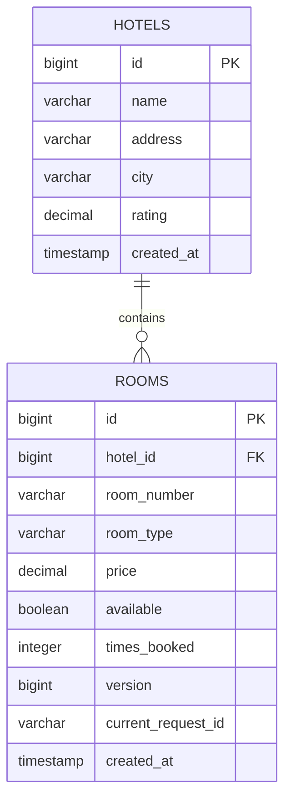
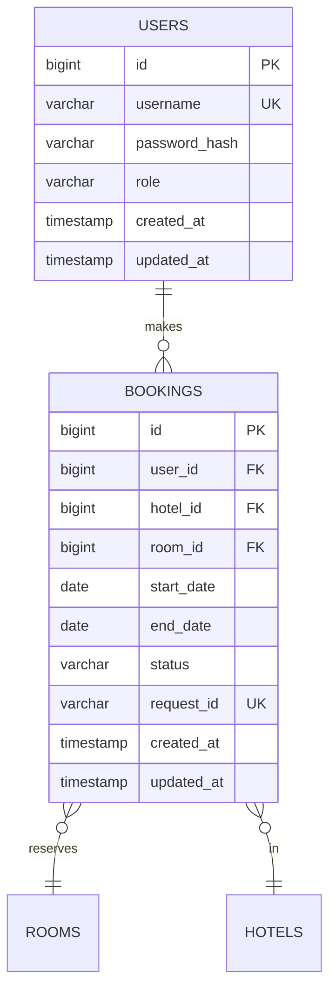

# ER-Диаграмма базы данных

## Hotel Service Database

```mermaid
erDiagram
    HOTELS ||--o{ ROOMS : "contains"
    
    HOTELS {
        bigint id PK
        varchar name
        varchar address
        varchar city
        decimal rating
        timestamp created_at
    }
    
    ROOMS {
        bigint id PK
        bigint hotel_id FK
        varchar room_number
        varchar room_type
        decimal price
        boolean available
        integer times_booked
        bigint version
        varchar current_request_id
        timestamp created_at
    }
```

## Booking Service Database

```mermaid
erDiagram
    USERS ||--o{ BOOKINGS : "makes"
    BOOKINGS }o--|| ROOMS : "reserves"
    BOOKINGS }o--|| HOTELS : "in"
    
    USERS {
        bigint id PK
        varchar username UK
        varchar password_hash
        varchar role
        timestamp created_at
        timestamp updated_at
    }
    
    BOOKINGS {
        bigint id PK
        bigint user_id FK
        bigint hotel_id FK
        bigint room_id FK
        date start_date
        date end_date
        varchar status
        varchar request_id UK
        timestamp created_at
        timestamp updated_at
    }
```
